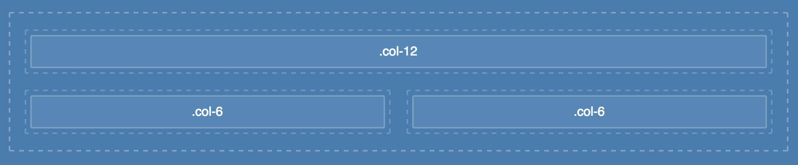

# kryt

## a simple, yet awesome grid system

kryt's goal is to create a simple grid system based on a variable quantity of columns. Every column width depends on a predefined grid and its gutter width.

### Example
If you choose a grid width of `980px` and a column count of `12` you will get `60px` for each column in the grid.

```
@single-column-width: ((@gridwidth - @gutter) / @columns) - @gutter;

```

#### Compiled CSS
```
.container {
  width: 980px;
  padding: 20px 18px;
}
.container .row {
  margin-bottom: 20px;
}
.container .row [class*="col-"] {
  margin: 0 20px 0 0;
}
.container .row .col-1 {
  width: 60px;
}
.container .row .col-2 {
  width: 140px;
}
.container .row .col-3 {
  width: 220px;
}
.container .row .col-4 {
  width: 300px;
}
.container .row .col-5 {
  width: 380px;
}
.container .row .col-6 {
  width: 460px;
}
.container .row .col-7 {
  width: 540px;
}
.container .row .col-8 {
  width: 620px;
}
.container .row .col-9 {
  width: 700px;
}
.container .row .col-10 {
  width: 780px;
}
.container .row .col-11 {
  width: 860px;
}
.container .row .col-12 {
  width: 940px;
}
.container .row .element {
  margin-bottom: 20px;
}
```

#### Example Grid



## License
MIT-style license.